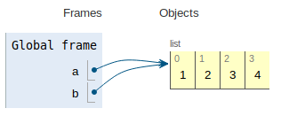
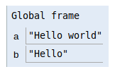
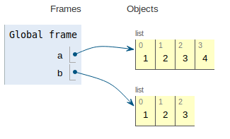
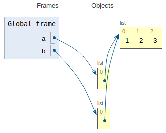

# Modifying objects

There is an important distinction in Python between *modifying a value in-place* and *creating a new value*. We'll try
to explain it here - read carefully, and try the quiz at the end!

## Objects can be modified in-place

Consider the following code. What will be printed?

```python
a = [1, 2, 3]
b = a
a.append(4)

print(b)
```

It may surprise you, but the answer is `[1, 2, 3, 4]`. This is because `a` and `b` are variables that **refer to the
same** list, and `.append()` will modify that commonly referenced list.

To see how it works, you can head over to [PythonTutor](http://pythontutor.com/visualize.html) and run the code:



## You can pass objects to functions and modify them

Here is another example:

```python
def modify_board(board, idx, mark):
    board[idx] = mark


my_board = [' '] * 9
print(my_board)  # will print: [' ', ' ', ' ', ' ', ' ', ' ', ' ', ' ', ' ']

modify_board(my_board, 4, 'X')
print(my_board)  # will print: [' ', ' ', ' ', ' ', 'X', ' ', ' ', ' ', ' ']
```

The `modify_board` function does not return the new board. It modifies the board in-place.

## Immutable objects are never modified in-place

What about the following?

```python
a = "Hello"
b = a
a += " world"

print(b)
```

This time, the answer will be just `"Hello"`, not `"Hello world"`. This is because `a` is a string, and **strings are
immutable**: they cannot be changed in-place. So `a += "world"` will create a new string, and `b` will still refer to
the old one.

Here is how it looks like in *PythonTutor*:



(Note: The visualisation suggests that `b = a` will copy the string instead of assigning reference. This is not strictly
true, but it makes no practical difference).

## If you create a new object, you will have to pass it back

Let's take a look at another function:

```
# Does not work

def multiply_by_2(num):
    num *= 2

my_num = 10
multiply_by_2(my_num)
print(my_num)  # will still print 10
```

The `multiply_by_2` function looks like `modify_board`, but it doesn't actually work. This is because it does not modify
a number in place, it sets the `num` variable to a new number, while `my_num` is still the old number.

To make the example work, you need to return the new number:

```python
def multiply_by_2(num):
    return num * 2


my_num = 10
my_num = multiply_by_2(my_num)
print(my_num)  # will print 20
```

Notice how we return the value in the function (`return num * 2`), and assign the result to the variable again (
`my_num = multiply_by_2(my_num)`).

## Objects can be copied

Let's go back to the example with lists. What if we want to modify one list (`a`), but also keep the other one (`b`)?

We need to **copy** the list, so that we have two separate objects:

```python
a = [1, 2, 3]
b = list(a)  # create a new list from a

a.append(4)

print(a)  # [1, 2, 3, 4]
print(b)  # [1, 2, 3]
```

Here is how it looks like in PythonTutor:



## Shallow and deep copying

Note that the situation is a bit different when you have, for example, a list of lists. If you have a list like
`[[1, 2, 3]]` (a list inside a list), and try to copy it, you will end up with something like this:



Now `a` and `b` refer to two separate outer lists, but both outer lists refer to a single inner list. The inner list did
not get copied. This is known as a **shallow copy**, because the copy is only one level deep.

If you want to copy everything, you need to make a **deep copy**. Check out the article in the Resources section that
explains the difference.

## Quiz

```
a_list = [1, 2, 3]
a_dict = {'hello': 'world'}
a_tuple = (1, 2, 3)
a_string = "Hello "
a_number = 123.45
```

Here are a few lines of code. Try to answer in each case: will the object be
**modified in-place**, or will a **new object** get created?

Lists:

- `a_list.append(4)`
- `a_list = a_list + [4]`
- `a_list[4] += 4`
- `a_list += [4]`
- `a_list.sort()`
- `a_list = sorted(a_list)`

Tuples:

- `a_tuple = a_tuple + (4, 5)`
- `a_tuple += (4, 5)`

Dictionaries:

- `a_dict['hello'] = 'WORLD'`
- `a_dict = dict(a_dict)`

Strings:

- `a_string += " world"`
- `a_string = a_string.replace("ello", "ELLO")`

Numbers:

- `a_number *= 15`

<details>
<summary> Click here to see the answers.</summary>

Lists:

- `a_list.append(4)` will modify the list in-place.
- `a_list = a_list + [4]` will create a new list (`a_list + [4]`).
- `a_list[4] += 4` will modify the list in-place (at least if it has a number at the 4th index).
- `a_list += [4]` will also modify the list in-place.
- `a_list.sort()` will sort the original list, while `sorted(a_list)` will return a new list.

Tuples:

- `a_tuple = a_tuple + (4, 5)` will create a new tuple.
- `a_tuple += (4, 5)` will also create a new tuple, because tuples are immutable.

Dictionaries:

- `a_dict['hello'] = 'WORLD'` will modify the dictionary in-place.
- `a_dict = dict(a_dict)` will copy the dictionary, creating a new one.

Strings:

- `a_string += " world"` will create a new string, because strings are immutable.
- `a_string = a_string.replace("ello", "ELLO")` will also create a new string.

Numbers:

- `a_number *= 15` will create a new number, because numbers are immutable.

</details>

## Resources

- [Mutable vs Immutable Objects in Python](https://medium.com/@meghamohan/mutable-and-immutable-side-of-python-c2145cf72747)
- [Variables in Python](https://realpython.com/python-variables/) on RealPython
- [Shallow vs Deep Copying of Objects](https://realpython.com/copying-python-objects/)
- [Is Python call-by-value or call-by-reference? Neither.](http://stupidpythonideas.blogspot.com/2013/11/does-python-pass-by-value-or-by.html)
